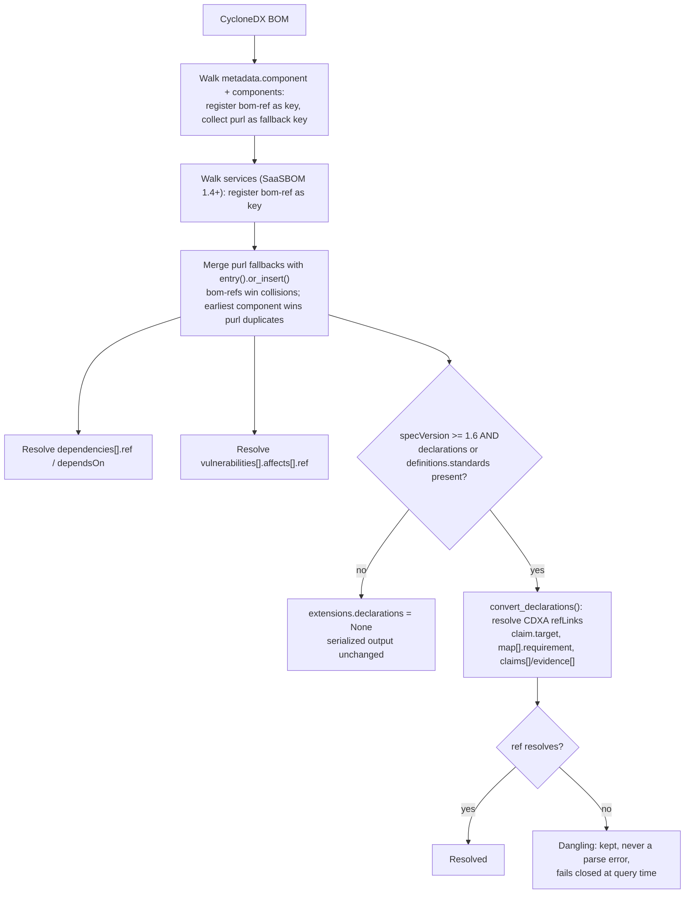
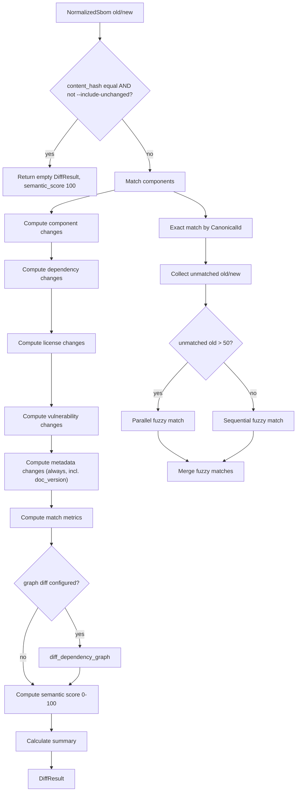
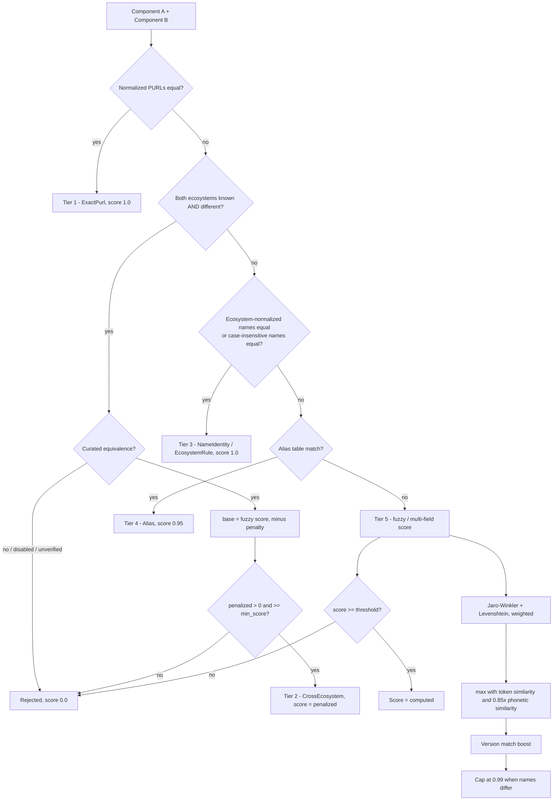
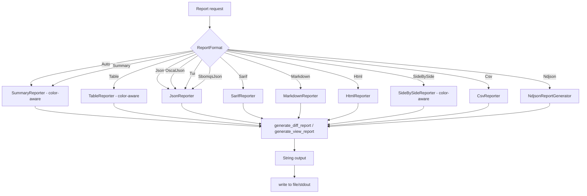
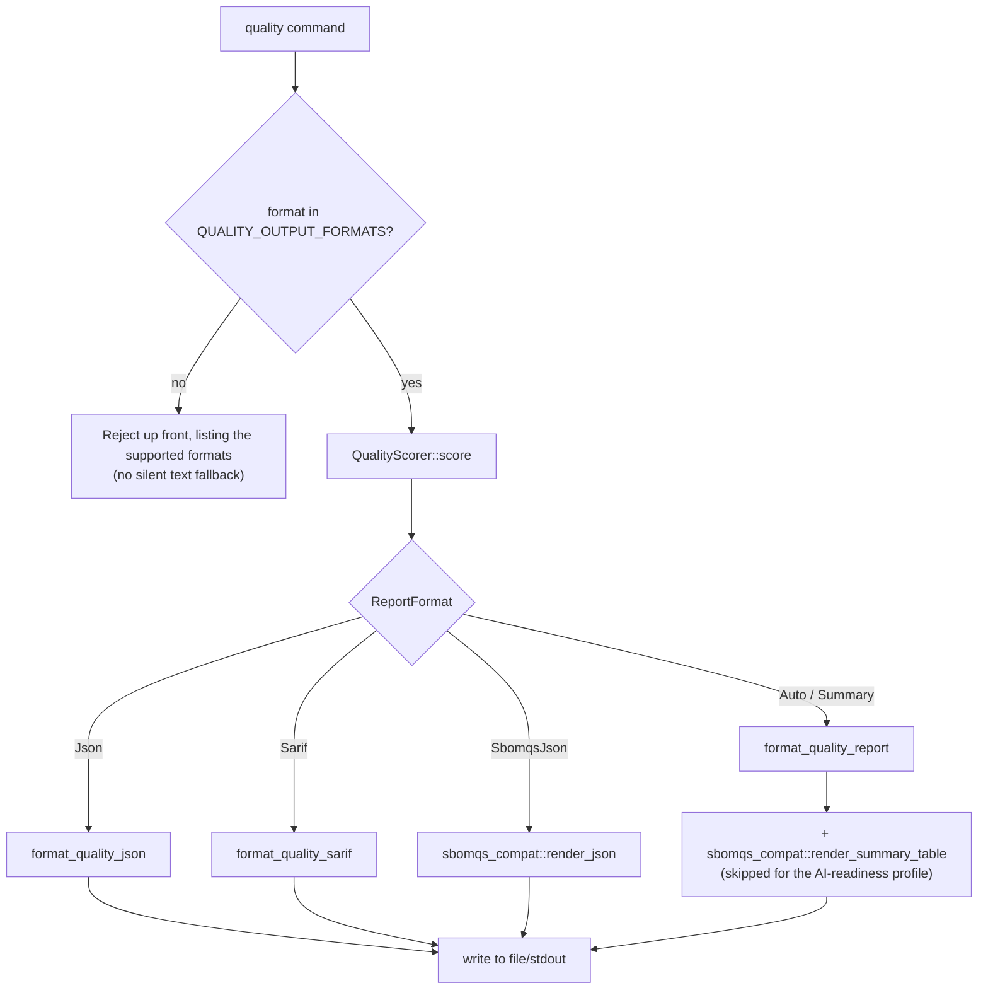
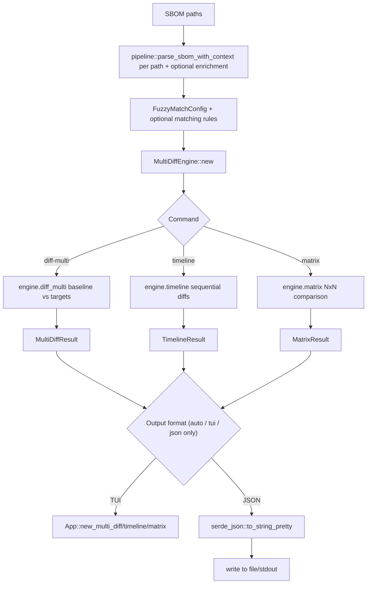
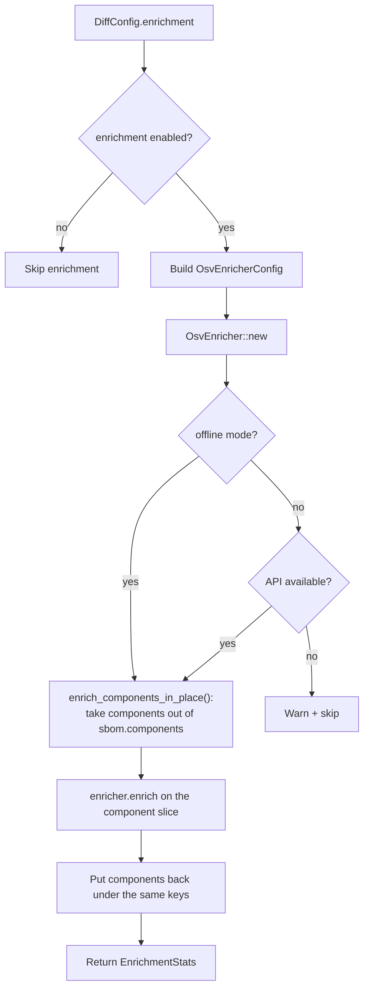
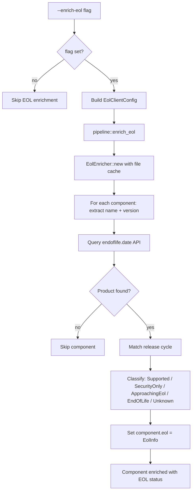

# Pipeline Diagrams

Conceptual process flows for non-stateful pipelines. These focus on data flow and
decision points rather than UI states.

## Ref Resolution (CycloneDX parser)
Source: `src/parsers/cyclonedx.rs`

Every intra-document reference in a CycloneDX BOM resolves through one
`id_map: HashMap<String, CanonicalId>`, built in a fixed order so that a real
`bom-ref` can never be shadowed by a purl.

Before this merge step, a `dependsOn` entry or a vulnerability `affects[].ref`
written as a purl — common when components declare no `bom-ref` at all — simply
failed to resolve and the edge or CVE link was dropped silently.

## Diff Pipeline (DiffEngine::diff)
Source: `src/diff/engine.rs`

The change sections (components/dependencies/licenses/vulnerabilities) are
gated by `ChangedSections` so the incremental path recomputes only what is
dirty; metadata changes, match metrics, the graph diff, the score and the
summary run on **every** path via the same `compute_sections` /
`finalize_result` pair, so the full and incremental paths cannot drift.

## Matching Pipeline (FuzzyMatcher::match_components)
Source: `src/matching/mod.rs` (with submodules: `scoring.rs`, `string_similarity.rs`, `adaptive.rs`, `lsh.rs`)

Tiers are tried in priority order; the first that fires wins. Identity, alias
and cross-ecosystem tiers carry their own acceptance criteria and bypass the
fuzzy threshold — only the fuzzy/multi-field tier is threshold-gated.

Note: adaptive thresholding (`src/matching/adaptive.rs`) is **not** part of this
scoring path. It is an opt-in analysis tool — `diff --recommend-threshold` runs
`AdaptiveThreshold::compute_threshold()` over the two SBOMs and prints a
recommended threshold and score distribution to stderr; the matcher itself uses
the configured threshold.

## Reporting Pipeline (Reporter selection + generation)
Source: `src/reports/mod.rs`

`create_reporter_with_options(format, use_color)` honours `use_color` for every
colored format (Summary, Table, SideBySide) — `--no-color`, `NO_COLOR`, and a
non-TTY destination all reach the reporter through this one flag.

`SbomqsJson` has no diff/view renderer and falls back to `JsonReporter` here; it
is a `quality`-command format, routed before this factory:

`sbomqs_compat` recomputes sbomqs v2.0.11 feature scores straight from the
NormalizedSbom (plus the raw document text); it never reads `QualityReport`, so
the 0-10 table and the 0-100 score are independent computations, not a rescale.

## Multi-SBOM Pipeline (diff-multi / timeline / matrix)
Source: `src/cli/multi.rs`, `src/diff/multi.rs`

Multi-SBOM commands reuse the pipeline for parsing and optional enrichment, then use `MultiDiffEngine` directly.

Note: Typed `MultiDiffConfig`; enrichment supported; no streaming; output
limited to JSON or TUI. `-o` is a restricted clap enum on these three commands,
so an unsupported value is a usage error (exit 2) before any SBOM is parsed.

Scale conventions across the multi-SBOM results (test-pinned):

| Value | Scale |
| --- | --- |
| `DiffResult.semantic_score` (single diff) | 0-100 |
| `MatrixResult::similarity_scores` | 0-1 (`semantic_score / 100`) |
| `MultiDiffSummary::deviation_scores` / `max_deviation` | 0-1 (`1 - similarity`) |

Aggregated multi-SBOM entries (variable / inconsistent / divergent / evolution)
are keyed by the **version-stripped logical purl** (e.g. `pkg:npm/express`), so
a version bump appears as one component with a version spread rather than as an
Added + Removed pair. `TimelineResult` additionally carries `incremental_pairs`
and `cumulative_pairs` — index-aligned `{from_index, to_index, from_name,
to_name}` records that label each diff in `incremental_diffs` /
`cumulative_from_first`.

## Vulnerability Enrichment Flow (feature-gated)
Source: `src/pipeline/parse.rs`, `src/cli/diff.rs`

The offline bypass matters: the availability probe is a live network call, so in
offline mode it would always fail and wrongly skip enrichment that the cache
could have served.

## EOL Enrichment Flow (feature-gated)
Source: `src/enrichment/eol/`, `src/cli/diff.rs`, `src/cli/view.rs`

